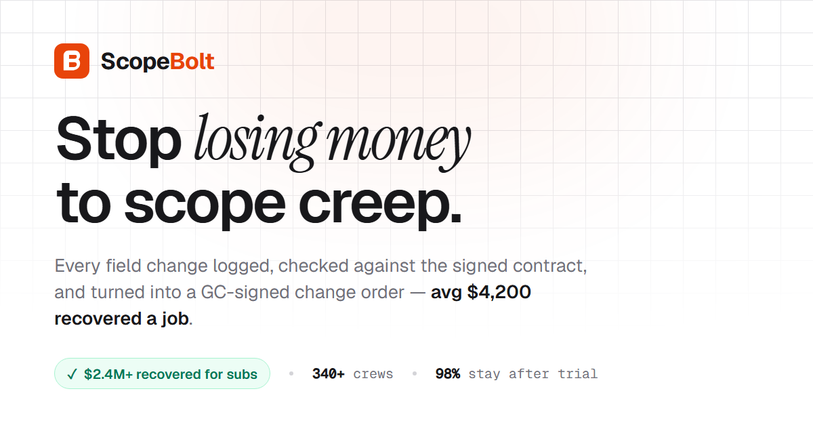

# ScopeBolt Landing Page

Marketing landing page for a fictional SaaS product called ScopeBolt. The project is built with Vite, React, and Tailwind CSS and is structured as a single-page site focused on commercial subcontractor workflow pain points.



## What is in the repo

- A React single-page landing page with custom sections for hero, proof, workflow, integrations, pricing, FAQ, and CTA.
- SEO and social preview metadata for the deployed site.
- GitHub Actions workflows for build verification and GitHub Pages deployment.

## Local development

```bash
npm install
npm run dev
```

Production build:

```bash
npm run build
```

Preview the production bundle locally:

```bash
npm run preview
```

## Deployment

The repo is configured for GitHub Pages deployment through GitHub Actions.

- Build validation runs on pushes and pull requests.
- Deployment runs automatically when `main` is updated.
- Expected Pages URL: `https://karumnieks99.github.io/saas-landing/`

## Project structure

The React app (ScopeBolt) is the deployed site. A few standalone static pages
live alongside it as separate design concepts and are **not** part of the Vite build.

```
index.html              Vite entry document for the React app (SEO/OG meta, font preload, #root mount)
src/
  main.jsx              React entry point — mounts <App/> into #root
  App.jsx               Root component / template switch (ScopeBolt by default; FlowPilot is a one-line swap)
  ScopeBolt.jsx         The ScopeBolt landing page (single-file: content constants + section components)
  FlowPilot.jsx         Alternate sellable landing-page template (see FLOWPILOT.md)
  index.css            Global stylesheet — IBM Plex Sans @font-face, Tailwind layers, base resets
  scopebolt-tokens.css ScopeBolt design-system tokens (semantic aliases over raw values)
public/
  fonts/               Self-hosted variable woff2 brand fonts (preloaded)
  og/                  Open Graph / social-card images (og-image.png, vltd-og.png)
  vendor/gsap/         Self-hosted GSAP build (no CDN single-point-of-failure)
.github/workflows/      CI (build validation) and GitHub Pages deployment

Standalone static concept pages (not part of the React build):
  business.html / business.css   "Stonebridge Advisory" operations-consulting concept
  vltd.html / vltd-scene.js       "VLTD" luxury landing page with a three.js hero turntable

Tooling & docs (local/non-deployed):
  .cdp-shot.mjs        Headless screenshot helper (writes to screenshots/, which is gitignored)
  screenshots/         Local verification screenshots (gitignored)
  design-md/           Reference design-system notes for various brands
  docs/                Specs and implementation plans
```

## Notes

- The live marketing copy is branded as ScopeBolt even though the repository name remains `saas-landing`.
- `business.html`/`business.css` and `vltd.html`/`vltd-scene.js` are separate static concept files and are not part of the React app build.
- Each source file opens with a header comment describing its role; start there when finding your way around.
